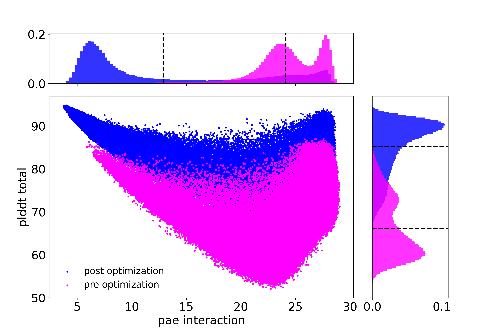

# ppi_iterative_opt

Protein protein interaction iterative optimization strategy to improve Alphafold2 validation metrics

## Description
This script takes a single PDB file of a protein-protein interaction (PPI) complex design as input and will try to improve Alphafold2 structure prediction validation metrics for the complex by cycling through iterations of RFdiffusion (partial diffusion), Protein MPNN, and Alphafold2 while keeping the target chain fixed.

## Reference
Edin Muratspahić et. al. De novo design of miniprotein agonists and antagonists targeting G protein-coupled receptors. Submitted to Nature. 2025

## Installation
You can clone this repo into a preferred destination directory by going to that directory and then running:

~~~
git clone https://github.com/davidekim/ppi_iterative_opt.git
~~~

You must install the dependencies for RFdiffusion, MPNN, and Alphafold2 by following the instructions from their respective web sites. 

Install Alphafold2 params.
~~~
cd ppi_iterative_opt/af2_initial_guess
mkdir params
cd params
wget https://storage.googleapis.com/alphafold/alphafold_params_2022-12-06.tar
tar -xf alphafold_params_2022-12-06.tar
cd ../../
~~~

Open ppi_iterative_opt.py in a text editor and edit the configuration parameters to point to your RFDiffusion, Protein MPNN, and Alphafold2 installations.

Optional:
Install Rosetta if you want to design with disulfides.
https://downloads.rosettacommons.org/software/academic/

## Usage
ppi_iterative_opt.py is the main script. The complex should contain 2 chains, chain A (the design) and chain B (the target).

`python ./ppi_iterative_opt.py input_complex.pdb`

### Dependencies
PyRosetta https://www.pyrosetta.org/

RFDiffusion https://github.com/RosettaCommons/RFdiffusion

Protein MPNN https://github.com/dauparas/ProteinMPNN

Alphafold2 https://github.com/google-deepmind/alphafold

Optional: Rosetta https://github.com/RosettaCommons/rosetta
