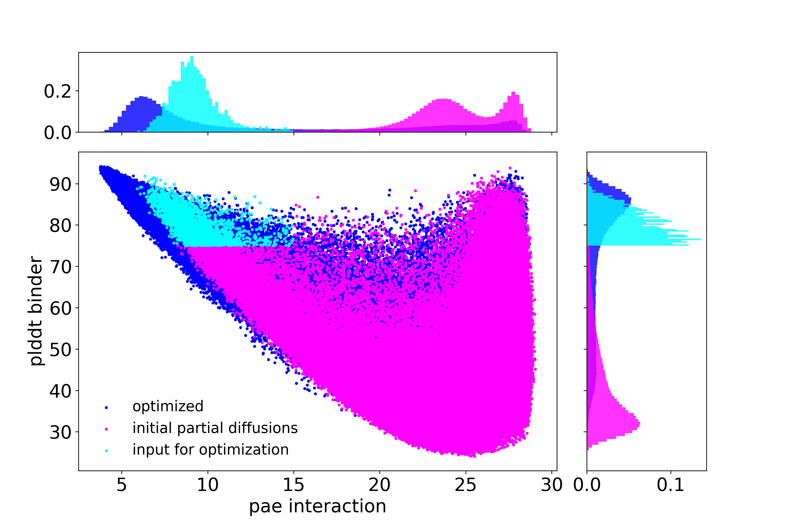

# ppi_iterative_opt

Protein protein interaction iterative optimization strategy to improve Alphafold2 validation metrics

## Description
This script takes a single PDB file of a protein-protein interaction (PPI) complex design as input and will try to improve Alphafold2 structure prediction validation metrics for the complex by cycling through iterations of RFdiffusion (partial diffusion), Protein MPNN + Rosetta FastRelax, and Alphafold2 while keeping the target chain fixed.

## References
Edin Muratspahić et. al. De novo design of miniprotein agonists and antagonists targeting G protein-coupled receptors. Submitted to Nature. 2025

Bennett, N.R., Coventry, B., Goreshnik, I. et al. Improving de novo protein binder design with deep learning. Nat Commun 14, 2625 (2023). https://doi.org/10.1038/s41467-023-38328-5

## Third Party Source Code
This repository provides versions of [Nathaniel's dl_binder_design code](https://github.com/nrbennet/dl_binder_design), [Justas' ProteinMPNN code](https://github.com/dauparas/ProteinMPNN), the AlphaFold2 source code with the "initial guess" modifications described in [this paper](https://www.nature.com/articles/s41467-023-38328-5), and [RFdiffusion](https://github.com/RosettaCommons/RFdiffusion). The AF2 source code is provided with the original DeepMind license at the top of each file.

## Installation
You can clone this repo into a preferred destination directory by going to that directory and then running:

~~~
git clone https://github.com/davidekim/ppi_iterative_opt.git
~~~

You must install the dependencies for RFdiffusion, MPNN, and Alphafold2 by following the instructions from their respective web sites. More information is available in the [dl_binder_design repo](https://github.com/nrbennet/dl_binder_design).

Install RFdiffusion checkpoint.
~~~
cd ppi_iterative_opt/rf_diffusion
mkdir models && cd models
wget https://files.ipd.uw.edu/pub/ppi_iterative_opt/rf_diffusion/models/BFF_4.pt
cd ../../../
~~~

Install Alphafold2 params.
~~~
cd ppi_iterative_opt/af2_initial_guess
mkdir params && cd params
wget https://storage.googleapis.com/alphafold/alphafold_params_2022-12-06.tar
tar -xf alphafold_params_2022-12-06.tar
cd ../../
~~~

Open ppi_iterative_opt.py in a text editor and edit the configuration parameters to point to alternative RFDiffusion, Protein MPNN, and/or Alphafold2 installations if desired.

Optional:
Install Rosetta if you want to design with disulfides.
https://downloads.rosettacommons.org/software/academic/

## Usage
ppi_iterative_opt.py is the main script. The complex should contain 2 chains, chain A (the design) and chain B (the target).

`python ./ppi_iterative_opt.py input_complex.pdb`

### Dependencies
PyRosetta https://www.pyrosetta.org/

Optional: Rosetta https://github.com/RosettaCommons/rosetta
